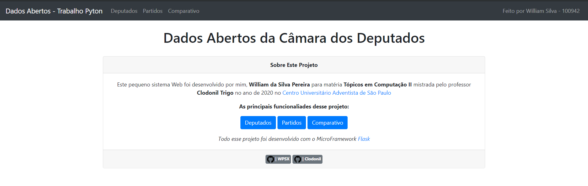

# DadosAbertoFlask

Um pequeno projeto Web para manipular a API dos Dados Aberto da Câmara dos Deputados com FLASK

   <a href="https://github.com/wspx" target="blank">
        WPSX
   </a>

    

   <a href="https://github.com/clodonil" target="blank">
          Clodonil
   </a>

